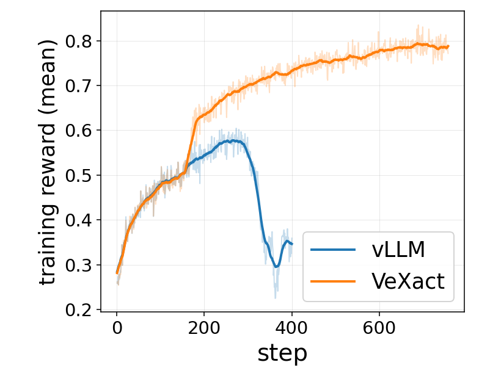
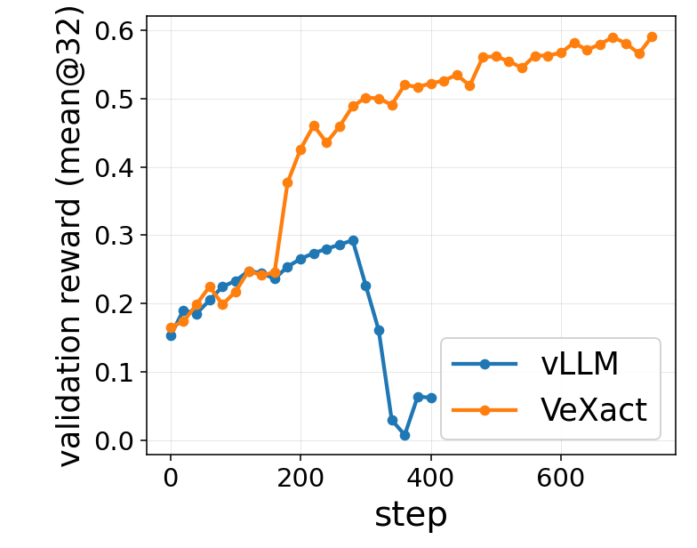
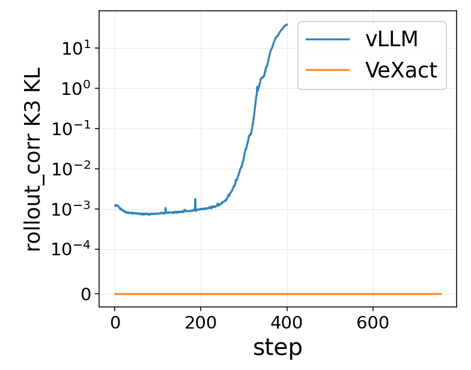
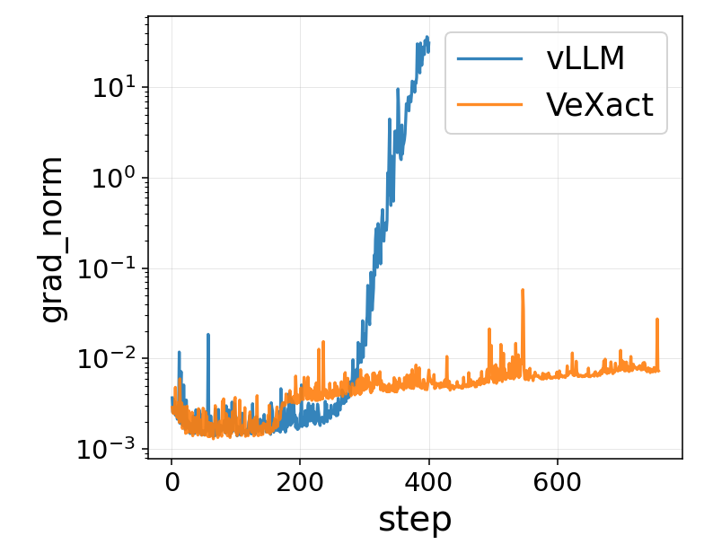

# VeXact

Transformer-based bitwise-aligned rollout for VeOmni FSDP with VeRL integration.

## Key Features

- 🎯 **Bitwise-aligned training & inference** — VeOmni FSDP actor and VeXact rollout engine produce identical logprobs for dense and MoE models with verl (the legacy FSDP engine is not supported for MoE models).
    - All the dense model should work out-of-the-box if they are not using ops that are different between training and inference like linear attention.
    - MoE models need to patch the model with Fused MoE kernel like our Qwen3-MoE and DeepSeek-V3 example.
- ⚡ **Fast and aligned kernels** — Fused MoE, fused linear cross-entropy, Flash Attention 3/4 with paged KV cache, all numerically consistent between training and inference
- 🧩 **Simple model definitions** — Transformer model code is self-contained and easy to audit, so training and inference model definitions stay in sync
- 📖 **Readable codebase** — Clean implementation with chunked prefill, pipeline parallelism, and CUDA graph support

## Effectiveness

> **Qwen3-30B-A3B · REINFORCE · DAPO dataset**

Off-policy logprob bias from vLLM causes the rollout-correction KL to explode after ~300 steps, which triggers gradient norm blow-up and ultimately training collapse. VeXact's bitwise-aligned rollout keeps the KL at exactly zero throughout, yielding stable training and a ~2× higher final AIME 2024 score.

<table>
  <tr>
    <td align="center"><b>Training reward</b></td>
    <td align="center"><b>AIME 2024 (mean@32)</b></td>
  </tr>
  <tr>
    <td></td>
    <td></td>
  </tr>
  <tr>
    <td align="center"><b>Rollout-correction K3 KL (log scale)</b></td>
    <td align="center"><b>Gradient norm (log scale)</b></td>
  </tr>
  <tr>
    <td></td>
    <td></td>
  </tr>
</table>

## Example Recipes

End-to-end RL training scripts live under [`examples/`](examples/README.md). Run any script from the repo root:

```bash
bash examples/getting_started/run_qwen3_1b7.sh
# override paths via env vars
model_dir=/path/to/model data_dir=/path/to/data bash examples/moe/run_qwen3_30B_A3B_dapo.sh
```

| Recipe                                                                              | Model                         | Dataset                   | Hardware | Algorithm     |
| ----------------------------------------------------------------------------------- | ----------------------------- | ------------------------- | -------- | ------------- |
| [`getting_started/run_qwen3_1b7.sh`](examples/getting_started/run_qwen3_1b7.sh)     | Qwen3-1.7B                    | gsm8k                     | 1×8H100  | GRPO          |
| [`moe/run_qwen3_30B_A3B_dapo.sh`](examples/moe/run_qwen3_30B_A3B_dapo.sh)           | Qwen3-30B-A3B                 | DAPO-Math-17k / AIME 2025 | 1×8H100  | DAPO          |
| [`moe/run_qwen3_30B_A3B_reinforce.sh`](examples/moe/run_qwen3_30B_A3B_reinforce.sh) | Qwen3-30B-A3B-Base            | DAPO-Math-17k / AIME 2024 | 8×8H100  | REINFORCE     |
| [`moe/run_qwen3_30B_A3B_16H100.sh`](examples/moe/run_qwen3_30B_A3B_16H100.sh)       | Qwen3-30B-A3B                 | gsm8k                     | 2×8H100  | GRPO          |
| [`moe/run_qwen3_30B_A3B_8B200.sh`](examples/moe/run_qwen3_30B_A3B_8B200.sh)         | Qwen3-30B-A3B                 | gsm8k                     | 1×8B200  | GRPO          |
| [`moe/run_moonlight_gsm8k.sh`](examples/moe/run_moonlight_gsm8k.sh)                 | Moonlight-16B-A3B-Instruct    | gsm8k                     | 1×8B200  | GRPO          |
| [`moe/run_moonlight_reinforce.sh`](examples/moe/run_moonlight_reinforce.sh)         | Moonlight-16B-A3B-Instruct    | DAPO-Math-17k / AIME 2024 | 1×8B200  | REINFORCE     |
| [`verify/run_dense_vexact.sh`](examples/verify/run_dense_vexact.sh)                 | DeepSeek-R1-Distill-Qwen-1.5B | MATH / AIME 2024+2025     | 1×8H100  | GRPO (vexact) |
| [`verify/run_dense_vllm.sh`](examples/verify/run_dense_vllm.sh)                     | DeepSeek-R1-Distill-Qwen-1.5B | MATH / AIME 2024+2025     | 1×8H100  | GRPO (vllm)   |

See [`examples/README.md`](examples/README.md) for path configuration, attention backend selection, and an explanation of the `verify/` pair.

## Installation

VeXact uses [uv](https://docs.astral.sh/uv/) for environment management. Pick
the extras that match your use case:

```bash
# End-to-end RL training (verl trainer + VeOmni FSDP actor + VeXact rollout):
uv sync --extra gpu --extra verl --extra veomni

# Rollout-only (no trainer, no FSDP actor):
uv sync --extra gpu

# Add the dev extra (pytest, pre-commit) when contributing:
uv sync --extra gpu --extra verl --extra veomni --extra dev
```

What each extra does:

- `gpu` — PyTorch (CUDA 12.9), FlashAttention 2/3/4, quack-kernels, NVML.
- `verl` — pulls verl from `verl-project/verl` (pinned by commit in
    `[tool.uv.sources]`) plus FastAPI/uvicorn/cachetools used by the trainer.
- `veomni` — pulls VeOmni from `ByteDance-Seed/VeOmni` (pinned by commit).
- `vllm` — vLLM 0.18 if you prefer it as the rollout engine instead of
    VeXact's native one.
- `dev` — `pytest`, `pytest-asyncio`, `pre-commit` for development.

### Working on verl or VeOmni locally

`verl` and `veomni` are pinned by git commit in `pyproject.toml`'s
`[tool.uv.sources]` block, so contributors and CI all resolve to the same
upstream. To hack on either upstream against your local checkout, swap the
relevant entry to `editable = true` (the file has inline hints):

```toml
[tool.uv.sources]
verl = { path = "./verl", editable = true }
veomni = { path = "./VeOmni", editable = true }
```

Then `uv sync --extra gpu --extra verl --extra veomni` re-resolves the venv
to your local tree.

## Components

- [`vexact/batch_invariant_ops/`](vexact/batch_invariant_ops/README.md) — batch-invariant operators/kernels for true on-policy RL training.

## Contribution Guide

See [contributions guide](CONTRIBUTING.md).

## Acknowledgements

Besides VeRL and VeOmni, VeXact builds on and is inspired by the following projects:

- [vLLM](https://github.com/vllm-project/vllm) — We refer to vLLM model runner-v2 design and reuse its sampler.
- [batch_invariant_ops](https://github.com/thinking-machines-lab/batch_invariant_ops) — Batch-invariant operators for deterministic inference
- [Torch Memory Saver](https://github.com/fzyzcjy/torch_memory_saver) - Model param and KV cache offloads.
- [FlashAttention](https://github.com/Dao-AILab/flash-attention) - We support FA4 for SM90+ (including SM100) GPU, including MLA shape for DeepSeek-V3 model architecture.

## Citation

If you find our work useful, please cite:

```bibtex
@article{zhong2026diagnosing,
  title={Diagnosing Training Inference Mismatch in LLM Reinforcement Learning},
  author={Zhong, Tianle and Ling, Neiwen and Pi, Yifan and Wei, Zijun and Yu, Tianshu and Fox, Geoffrey and Wu, Peng and Yu, Xiao},
  journal={arXiv preprint arXiv:2605.14220},
  year={2026}
}
```
